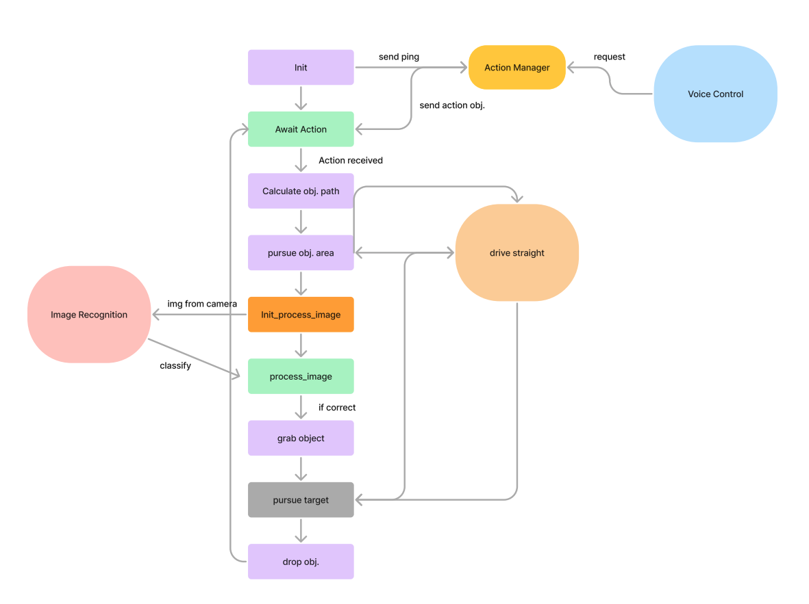

# robotics-final-project: RoboCourier

## Project Description

**Goal:**
The goal of RoboCourier is to develop an autonomous robot capable of delivering items within a predefined environment. This project explores the integration of robotics algorithms for navigation, object detection, and manipulation to achieve efficient and reliable item delivery.

**Interest:**
Our interest in this project stems from the potential applications in logistics and automation, where autonomous robots can significantly enhance efficiency and reduce human effort in repetitive tasks.

**Robot Functionality:**
RoboCourier is designed to navigate through an environment, identify delivery locations, pick up items, and deliver them to specified destinations using a combination of sensors and algorithms.

**Main Components:**
- **Navigation:** Utilizing SLAM (Simultaneous Localization and Mapping) for environment mapping and path planning.
- **Object Detection:** Implementing computer vision techniques for identifying items and delivery points.
- **Manipulation:** Using robotic arms for picking up and placing items.

## System Architecture

**Navigation:**
- **SLAM Algorithm:** The robot uses the SLAM algorithm to create a map of its environment and plan the optimal path to the delivery location.
- **Path Planning:** The navigation system calculates the best route considering obstacles and dynamic changes in the environment.

**Object Detection:**
- **Computer Vision:** The robot employs a camera and image processing algorithms to detect and recognize items and delivery points.
- **Sensor Integration:** Data from various sensors, including LIDAR and ultrasonic sensors, are used to enhance detection accuracy.

**Manipulation:**
- **Robotic Arm Control:** The robot’s arm is controlled using inverse kinematics to pick up and place items accurately.
- **Gripper Mechanism:** A custom-designed gripper is used to handle different objects securely.

**Flowchart:**


## ROS Node Diagram for RoboCourier

1. **Nodes:**
   - **Voice Control Node:** Handles voice commands and sends requests to the Action Manager.
   - **Action Manager Node:** Manages and dispatches actions based on requests from Voice Control.
   - **Image Recognition Node:** Processes images from the camera and classifies objects.
   - **Navigation Node:** Manages the robot’s movement, including driving straight and pursuing objects.
   - **Manipulation Node:** Controls the robotic arm for grabbing and dropping objects.

2. **Topics:**
   - `/voice_control/request`: Published by Voice Control, subscribed by Action Manager.
   - `/action_manager/action`: Published by Action Manager, subscribed by Navigation and Manipulation Nodes.
   - `/camera/image_raw`: Published by the camera, subscribed by Image Recognition.
   - `/image_recognition/classification`: Published by Image Recognition, subscribed by Navigation and Manipulation Nodes.
   - `/navigation/cmd_vel`: Published by Navigation, subscribed by the robot’s motors.
   - `/manipulation/grip_command`: Published by Manipulation, subscribed by the robotic arm controller.


### ROS Node Diagram
```plaintext
 Voice Control Node         Action Manager Node            Image Recognition Node
   |                               |                              |
   |--/voice_control/request---->  |                              |
   |                               |--/action_manager/action--->  |
   |<--/action_manager/action---   |                              |
   |                               |                              |
 Camera Node  -----------------> Image Recognition Node  -------------------->  Navigation Node
   |                             |                                  |
   |--/camera/image_raw------->  |                                  |
   |                             |--/image_recognition/classification--->  |
   |<--/cmd_vel----------------  |                                  |
   |                             |                                  |
 Manipulation Node  --------------------------------------------------------->
   |                                                                          |
   |<--/grip_command--------------------------------------------------------- |
```

### Explanation:
- **Voice Control Node** sends a request to the **Action Manager Node**.
- **Action Manager Node** sends action commands to the **Navigation Node** and the **Manipulation Node**.
- **Camera Node** publishes raw images to the **Image Recognition Node**.
- **Image Recognition Node** processes images and publishes classifications.
- **Navigation Node** receives commands and classifications to control the robot's movements.
- **Manipulation Node** receives commands to control the robotic arm.

## Execution
Generate an OpenAI API Key, put the API key in `client = OpenAI(api_key = '<YOUR_API_KEY_HERE>'` within both `main_node.py` and `action_manager.py`.

Replace the `music.mp3`'s absolute path in `play_music.py` with its absolute path in your environment
  
`roscore`

`ssh pi@<YOUR_TURTLEBOT_IP>` and `bringup`

`ssh pi@<YOUR_TURTLEBOT_IP>` and `bringup_cam`

`roslaunch turtlebot3_manipulation_bringup turtlebot3_manipulation_bringup.launch`

`roslaunch turtlebot3_manipulation_moveit_config move_group.launch`

`roslaunch robocourier action.launch`

> **Note:** If you encounter any troubles, it is likely due to missing libraries. Use  `pip instal XXX` command to install necessary libraries.

## Challenges, Future Work, and Takeaways

**Challenges:**
- **Sensor Integration:** Ensuring seamless integration and synchronization of data from multiple sensors.
- **Navigation Accuracy:** Achieving precise navigation in dynamic environments with moving obstacles.
- **Object Handling:** Designing a gripper mechanism that can handle various object shapes and sizes.

**Future Work:**
- **Enhanced Object Detection:** Implementing advanced machine learning techniques for better accuracy.
- **Multi-Robot Coordination:** Expanding the system to coordinate multiple robots for collaborative tasks.
- **Environment Adaptation:** Improving the robot's ability to adapt to new and changing environments.

**Takeaways:**
- Practical experience with SLAM and robotic manipulation.
- Understanding the challenges and solutions in autonomous navigation and object handling.
- Insights into the integration of various robotics components and algorithms.


## GitHub Repository

**Link:** [RoboCourier GitHub Repo](https://github.com/terastion/robotics-final-project)

## Summary

In summary, RoboCourier demonstrates the successful integration of navigation, object detection, and manipulation for autonomous item delivery. Through this project, we tackled various challenges, learned valuable lessons, and identified areas for future improvement, showcasing the potential of robotics in automating delivery tasks.
